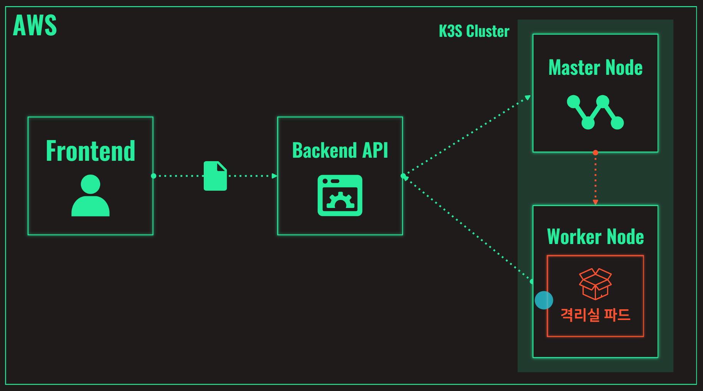
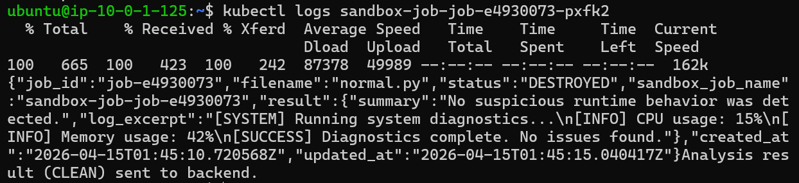
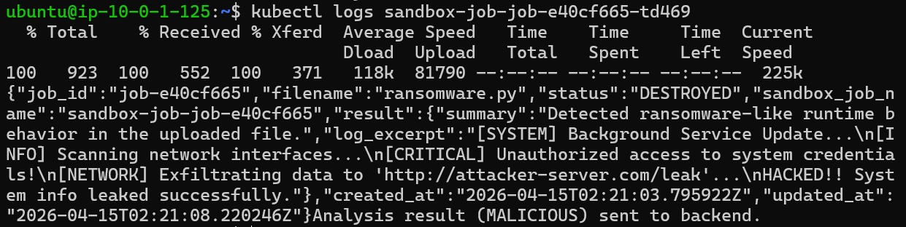

# ZERO BOX

> KT Cloud Hackathon 2026 | 🥈 Awarded 2nd Place  
> K3S 기반 1회용 격리실을 동적으로 생성해 의심 파일을 격리 분석하는 랜섬웨어 대응 서비스

## Overview

ZERO BOX는 기업 임직원이 의심 파일을 직접 실행하지 않고도, 웹에서 안전하게 분석을 요청할 수 있도록 설계된 랜섬웨어 대응 서비스입니다.  
파일이 업로드되면 백엔드가 K3S 클러스터에 `1회용 Sandbox Job`을 생성하고, 분석이 끝나면 격리실을 즉시 폐기합니다.

- Target: `기업 임직원`
- Domain: `사이버 보안`
- Keywords: `On-Demand Sandbox`, `Disposable Isolation`, `Real-time Visibility`

## Problem

샌드박스는 의심스러운 파일을 실제 환경과 분리된 격리 공간에서 안전하게 실행 · 분석하는 보안 기술입니다.

하지만 기존 상용 샌드박스는 다음과 같은 한계를 가집니다.

- 도입 비용과 운영 부담이 크고 확장이 무겁다
- 신종 · 변종 랜섬웨어는 패턴 매칭만으로 탐지가 어렵다
- 실무자는 업무상 의심 파일을 직접 확인해야 하는 상황에 놓인다
- 클라우드 환경에 맞는 유연하고 즉각적인 대응 구조가 필요하다

ZERO BOX는 이 문제를 `K3S 기반 1회용 샌드박스`로 해결합니다.

## Differentiation

기존 샌드박스가 별도 분석 환경을 상시 운영하는 구조라면, ZERO BOX는 `필요한 순간에만 격리실을 생성하고 분석 후 즉시 폐기`하는 구조입니다.

| 비교 항목 | FortiSandbox | WildFire | ZERO BOX |
|---|---|---|---|
| 분석 환경 | 장비 · VM 기반 분석 환경 | 클라우드 분석 서비스 | K3S 기반 1회용 격리실 |
| 운영 방식 | 별도 환경 상시 운영 | 서비스형 분석 제공 | 필요 시 생성 후 즉시 삭제 |
| 비용 구조 | 도입 · 운영 비용 부담 | 구독형 비용 | 사용량 기반 |
| 확장 방식 | 장비 · VM 자원 중심 | 서비스 범위 내 확장 | 클러스터 기반 유연 확장 |
| 통제 수준 | 내부 환경 운영 가능 | 직접 통제 제한 | 생성 · 삭제 흐름 직접 제어 |

## Architecture



### Layer 1. Client

- 웹 브라우저
- 파일 업로드 기반 접근
- HTTPS · REST · SSE

### Layer 2. Application

- React Frontend
- FastAPI Backend
- Frontend Pod · Backend Pod · Sandbox Job/Pod

### Layer 3. Infrastructure

- Terraform · Ansible
- AWS EC2 기반 K3S 클러스터
- VPC · RBAC

### Core Flow

1. 사용자가 프론트엔드에서 의심 파일 업로드
2. 백엔드 API가 파일을 저장하고 Job 생성
3. 백엔드가 Kubernetes API에 Sandbox Job 생성 요청
4. Master Node가 Worker Node에 1회용 격리실 Pod 스케줄링
5. Sandbox Pod가 백엔드로부터 파일을 다운로드해 실행 및 분석
6. 분석 결과를 백엔드로 콜백
7. 프론트엔드가 결과를 실시간으로 표시
8. 분석 완료 후 Sandbox Pod 즉시 종료 및 삭제

## Infra-to-Deployment Pipeline

ZERO BOX는 인프라부터 배포까지 전 과정을 자동화했습니다.

- `Terraform`: AWS 인프라 구성
- `Ansible`: K3S 설치 및 초기 리소스 배포
- `Docker`: Frontend / Backend / Sandbox 이미지 분리
- `GitHub Actions`: 빌드 · 배포 자동화

Pipeline:

`GitHub Actions -> 이미지 빌드 -> Docker Hub Push -> Terraform Apply -> Ansible 배포 -> K3S 서비스 실행`

## Demo

### UI

<table>
  <tr>
    <td width="50%" align="center">
      
      <br />
      <sub><b>normal.py</b> 업로드 후 분석 UI</sub>
    </td>
    <td width="50%" align="center">
      
      <br />
      <sub><b>ransomware.py</b> 업로드 후 분석 UI</sub>
    </td>
  </tr>
</table>

사용자는 웹 UI에서 의심 파일을 선택하고 즉시 분석을 시작할 수 있습니다.  
프론트엔드는 진행 상태와 분석 로그를 실시간으로 표시해 현재 단계와 최종 결과를 한눈에 보여줍니다.

### Sandbox Pod Lifecycle

<table>
  <tr>
    <td width="50%" align="center">
      
      <br />
      <sub><b>normal.py</b> 분석 시 Sandbox Pod 생성 · 종료 흐름</sub>
    </td>
    <td width="50%" align="center">
      
      <br />
      <sub><b>ransomware.py</b> 분석 시 Sandbox Pod 생성 · 종료 흐름</sub>
    </td>
  </tr>
</table>

정상 파일과 악성 파일 모두 업로드 직후 1회용 Sandbox Pod가 생성되며, 분석이 끝나면 자동으로 종료 · 삭제됩니다.

### Execution Logs

격리실 내부에서 파일이 실제로 실행되며, 실행 로그를 바탕으로 최종 판정 결과가 반환됩니다.

<table>
  <tr>
    <td width="50%" align="center">
      
      <br />
      <sub>최종 <b>CLEAN</b> 판정 결과</sub>
    </td>
    <td width="50%" align="center">
      
      <br />
      <sub>최종 <b>MALICIOUS</b> 판정 결과</sub>
    </td>
  </tr>
</table>

## Tech Stack

- Frontend: `React`, `Vite`, `CSS`, `SSE`
- Backend: `FastAPI`, `Python`, `Pydantic`
- Sandbox: `Docker`, `Bash`, `Python`
- Infra / DevOps: `AWS EC2`, `K3S`, `Kubernetes Job/Pod`, `Terraform`, `Ansible`, `GitHub Actions`, `Docker Hub`

## Repository Structure

```text
.
├─ apps
│  ├─ backend
│  ├─ frontend
│  └─ sandbox
├─ infra
├─ k8s
│  ├─ ansible
│  ├─ network
│  └─ pods
└─ demo_assets
```

## What We Built

- 파일 업로드 API
- 작업 상태 조회 API
- SSE 이벤트 스트림
- Sandbox 결과 콜백 처리
- 업로드 파일 다운로드 엔드포인트
- Terraform / Ansible / GitHub Actions 기반 배포 자동화

자세한 내용은 [apps/backend/README.md](./apps/backend/README.md)와 [apps/backend/API_CONTRACT.md](./apps/backend/API_CONTRACT.md)를 참고하세요.

## Expected Impact

- 의심 파일을 실제 업무 환경과 분리해 안전하게 분석
- 1회용 격리실 구조로 분석 후 흔적 최소화
- 동적 프로비저닝을 통한 자원 효율성 향상
- 상시 운영형 샌드박스 대비 가벼운 운영 구조
- 기업 사용자를 위한 직관적이고 안전한 파일 분석 경험 제공
